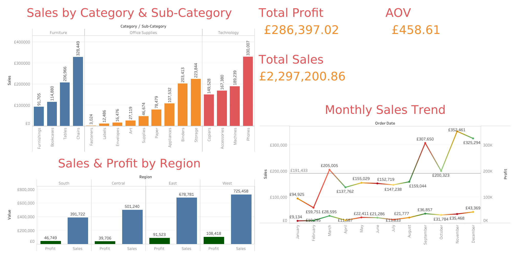

# 📊 Superstore Performance Dashboard (2023)

This project analyzes the **Superstore dataset** using Tableau.  
The goal was to explore **sales, profit, categories, and regional trends**.

## 📸 Dashboard Preview

## 🔑 Key Insights
- **West Region** had the highest sales (£725K) and profit (£108K).  
- **Technology** outperformed with Phones (£330K sales).  
- Average Order Value (AOV) = **£459**.  
- Monthly sales peaked in **November (~£307K)**.  
- Total sales = **£2.29M** with **£286K profit**.  

## 🚀 Tools Used
- Tableau Public  
- Sample Superstore dataset  

## 🔗 Links
- **Interactive Dashboard**: https://public.tableau.com/app/profile/blessey.carmichael/viz/SuperstoreDashboard_17574594457980/Dashboard1
- **LinkedIn Post**: (https://www.linkedin.com/posts/blessey-carmichael-prabu-doss_my-second-tableau-project-superstore-performance-activity-7371323213404053504-poG3?utm_source=share&utm_medium=member_ios&rcm=ACoAACWk9MkBqMmodE0zYjvDHPRKgB59aKqUqeg)  
